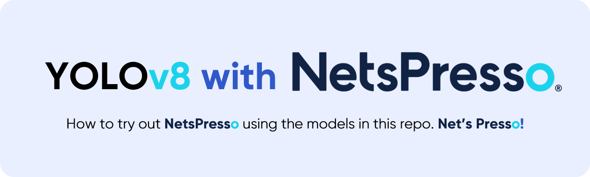

<div align="center">
  <p>
    <a align="center" href="README.netspresso.md" target="_blank">
      </a>
  </p>

</div>

# <div align="center">NetsPresso Tutorial for YOLOv8 Compressrion</div>
## Order of the tutorial
[1. Install](#1-install) </br>
[2. Convert yolov8 to _torchfx.pt](#2-convert-yolov8-to-_torchfxpt) </br>
[3. Model Compression with NetsPresso API Package](#3-model-compression-with-netspresso-api-package) </br>
[4. Fine-tuning the compressed Model](#4-fine-tuning-the-compressed-model) </br>
</br>

## 1. Install
```bash
git clone https://github.com/Nota-NetsPresso/ultralytics_nota
cd ultralytics_nota
pip install -e .
```
</br>

## 2. Convert YOLOv8 to _torchfx.pt
Create a trained 'yolov8.pt' file by referring to the existing README. Executing the following code creates 'model_fx.pt' and 'netspresso_head_meta.json'.
```python
from ultralytics import YOLO

model = YOLO('yolov8.pt') # load a pretrained model (recommended for training)

model.export_netspresso() # Through this code, 'model_fx.pt' and 'netspresso_head_meta.json' are created.
```
</br>

## 3. Model Compression with NetsPresso API Package
Upload & compress your 'model_torchfx.pt' by using NetsPresso API Package
### 3_1. Install NetsPresso API Package
```bash
pip install netspresso
```
### 3_2. Upload & Compress
First, you import the necessary libraries or packages and set a NetsPresso username and password.
```python
from loguru import logger

from netspresso.compressor import ModelCompressor, Task, Framework, CompressionMethod, RecommendationMethod


EMAIL = "YOUR_EMAIL"
PASSWORD = "YOUR_PASSWORD"
compressor = ModelCompressor(email=EMAIL, password=PASSWORD)
```
Second, upload 'model_torchfx.pt', which is the model converted to torchfx in step 2, with the following code.
```python
# Upload Model
UPLOAD_MODEL_NAME = "test_h5"
TASK = Task.IMAGE_CLASSIFICATION
FRAMEWORK = Framework.TENSORFLOW_KERAS
UPLOAD_MODEL_PATH = "./mobilenetv1.h5"
INPUT_LAYERS = [{"batch": 1, "channel": 3, "dimension": [32, 32]}]
model = compressor.upload_model(
    model_name=UPLOAD_MODEL_NAME,
    task=TASK,
    framework=FRAMEWORK,
    file_path=UPLOAD_MODEL_PATH,
    input_layers=INPUT_LAYERS,
)
logger.info(f"model id: {model.model_id}")
```
Finally, you can compress the uploaded model with the desired options through the following code.
```python
# Recommendation Compression
COMPRESSED_MODEL_NAME = "test_l2norm"
COMPRESSION_METHOD = CompressionMethod.PR_L2
RECOMMENDATION_METHOD = RecommendationMethod.LAMP
RECOMMENDATION_RATIO = 0.6
OUTPUT_PATH = "./mobilenetv1_cifar100_recommend.h5"
compressed_model = compressor.recommendation_compression(
    model_id=model.model_id,
    model_name=COMPRESSED_MODEL_NAME,
    compression_method=COMPRESSION_METHOD,
    recommendation_method=RECOMMENDATION_METHOD,
    recommendation_ratio=RECOMMENDATION_RATIO,
    output_path=OUTPUT_PATH,
)
logger.info(f"compressed model id: {compressed_model.model_id}")
```

<details>
<summary>Click to check 'Full Upload&Compress Code'</summary>

```bash
pip install netspresso
```

```python
from loguru import logger

from netspresso.compressor import ModelCompressor, Task, Framework, CompressionMethod, RecommendationMethod


EMAIL = "YOUR_EMAIL"
PASSWORD = "YOUR_PASSWORD"
compressor = ModelCompressor(email=EMAIL, password=PASSWORD)

# Upload Model
UPLOAD_MODEL_NAME = "test_h5"
TASK = Task.IMAGE_CLASSIFICATION
FRAMEWORK = Framework.TENSORFLOW_KERAS
UPLOAD_MODEL_PATH = "./mobilenetv1.h5"
INPUT_LAYERS = [{"batch": 1, "channel": 3, "dimension": [32, 32]}]
model = compressor.upload_model(
    model_name=UPLOAD_MODEL_NAME,
    task=TASK,
    framework=FRAMEWORK,
    file_path=UPLOAD_MODEL_PATH,
    input_layers=INPUT_LAYERS,
)

# Recommendation Compression
COMPRESSED_MODEL_NAME = "test_l2norm"
COMPRESSION_METHOD = CompressionMethod.PR_L2
RECOMMENDATION_METHOD = RecommendationMethod.LAMP
RECOMMENDATION_RATIO = 0.6
OUTPUT_PATH = "./mobilenetv1_cifar100_recommend.h5"
compressed_model = compressor.recommendation_compression(
    model_id=model.model_id,
    model_name=COMPRESSED_MODEL_NAME,
    compression_method=COMPRESSION_METHOD,
    recommendation_method=RECOMMENDATION_METHOD,
    recommendation_ratio=RECOMMENDATION_RATIO,
    output_path=OUTPUT_PATH,
)
```

</details>

More commands can be found in the official NetsPresso API Package Docs: 공식 문서 URL 올 자리 <br/>

Alternatively, you can do the same as above through the GUI on our website: https://console.netspresso.ai/models<br/><br/>

## 4. Fine-tuning the compressed Model</br>
The compressed model can be retrained with the following code.</br>
In the location of '/ultralytics_nota/compressed_model.pt', enter the path to the compressed model obtained in step 3. </br>
In the location of '/ultralytics_nota/netspresso_head_meta.json', enter the path of 'netspresso_head_meta' obtained in step 2. </br>
In place of 'detect_retraining', enter '[classify, detect, segment, pose]_retraining'.
In the last option, enter the path to the yaml where you have entered the settings required for training. </br>
```python
model = YOLO_netspresso('/ultralytics_nota/compressed_model.pt', '/ultralytics_nota/netspresso_head_meta.json', 'detect_retraining', '/ultralytics_nota/new_args.yaml')
```
If you want to perform additional compression, just restart the fine-tuned compressed model from step 2.</br>
Now you can use the compressed model however you like! </br></br>

## <div align="center">Contact</div>

Join our <a href="https://github.com/orgs/Nota-NetsPresso/discussions">Discussion Forum</a> for providing feedback or sharing your use cases, and if you want to talk more with Nota, please contact us <a href="https://www.nota.ai/contact-us">here</a>.</br>
Or you can also do it via email(contact@nota.ai) or phone(+82 2-555-8659)!

<br>
<div align="center">
  <a href="https://github.com/Nota-NetsPresso" style="text-decoration:none;">
    </a>
  
  <a href="https://www.facebook.com/NotaAI" style="text-decoration:none;">
    </a>
  
  <a href="https://twitter.com/nota_ai" style="text-decoration:none;">
    </a>
  
  <a href="https://www.youtube.com/channel/UCeewYFAqb2EqwEXZCfH9DVQ" style="text-decoration:none;">
    </a>
  
  <a href="https://www.linkedin.com/company/nota-incorporated" style="text-decoration:none;">
    </a>
</div>